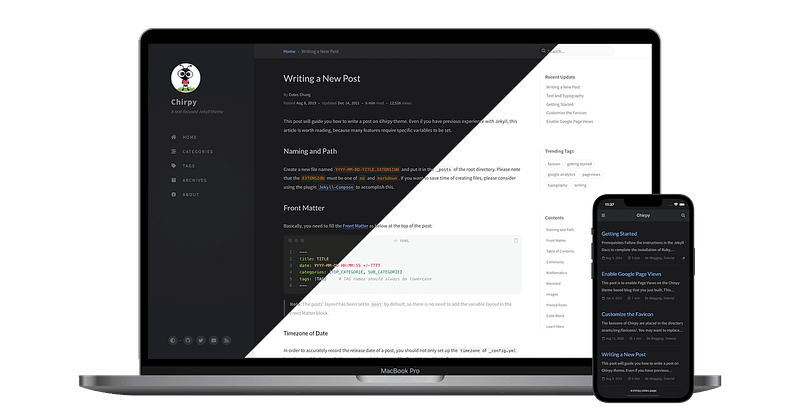

Most collaborative documentation platforms — like Confluence, Notion, and GitBook — charge per-user fees and often lack affordable SSO. For example, GitBook's SSO-enabled plans cost $250+/month per site, plus $12+ per user.

This solution provides an enterprise-grade, cost-effective, and private alternative, ideal for internal or semi-public documentation sites. It combines modern CI/CD automation with organization-based SSO security — all while keeping costs near zero (or $9/month if SSO is required).

This guide uses:
- **Jekyll** with the Chirpy theme
- **GitHub Actions** for CI/CD
- **Azure Static Web Apps** for hosting and authentication via Azure AD SSO

---

## Prerequisites

- GitHub account
- Azure account with permissions to create Static Web Apps and App Registrations
- Basic understanding of Jekyll or static site generation

## Step 1: Prepare Jekyll and Repository

**Use the Chirpy Starter Template:**

On GitHub, click **Use this template** → create a new repo (public or private). Name it after your target domain (e.g., `docs.company.com`).

**Local Jekyll Installation (Optional but Recommended)**

You can run Jekyll locally to test before deployment.

1. Follow the Jekyll Installation Docs or Chirpy's Getting Started Guide.
2. In your project directory, run `bundle exec jekyll serve`.
3. Open http://localhost:4000 to preview the site and troubleshoot issues.

## Step 2: Create an Azure Static Web App

1. In Azure Portal, search for **Static Web Apps** → **Create**.
2. Choose your resource group and name (e.g., `docs.company.com`).
3. Plan type:
   - **Free** — no SSO
   - **Standard ($9/mo)** — enables SSO
4. Deployment source: **GitHub**
   - Connect to your GitHub account
   - Select Organization, Repository, and Branch (`main`)
5. Build preset: **Custom**
   - App location: `/`
   - App artifact location: `_site`
6. Click **Review + Create**.

After deployment, Azure will auto-create a file named `azure-static-web-apps-xxx.yml` and add a deployment secret to GitHub. The first deployment will fail — this is expected and will be fixed in later steps.

## Step 3: Create an Azure App Registration (for SSO)

An App Registration enables authentication, secrets, and redirect URIs.

1. In Azure AD, create a new App Registration (e.g., `docs.company.com`).
2. Choose **Single tenant**.
3. Add redirect URIs:
   - `https://<swa-app-name>.azurestaticapps.net/.auth/login/aad/callback`
   - `https://docs.company.com/.auth/login/aad/callback`
4. Under **Branding & Properties**, set the homepage to `https://docs.company.com`.
5. Under **Authentication**, enable **ID tokens** (used for implicit and hybrid flows).
6. Under **Certificates & Secrets**, create a new client secret → copy the secret value.
7. Under **API permissions**, add Microsoft Graph → `User.Read`, then grant admin consent.
8. In your Static Web App → **Settings** → **Environment variables**, add:
   - `AZURE_CLIENT_SECRET` = copied secret value
   - `AZURE_CLIENT_ID` = your Client ID from the App Registration

### Add the `staticwebapp.config.json` File

Add this file to the root of your repository (same level as `_config.yml` and `_posts/`). It configures Azure AD authentication and access rules — requiring Azure AD login, redirecting unauthenticated users to Microsoft login, and referencing your app registration credentials from environment variables.

```json
{
  "auth": {
    "identityProviders": {
      "azureActiveDirectory": {
        "registration": {
          "openIdIssuer": "https://login.microsoftonline.com/<TENANT_ID>/v2.0",
          "clientIdSettingName": "AZURE_CLIENT_ID",
          "clientSecretSettingName": "AZURE_CLIENT_SECRET"
        }
      }
    }
  },
  "routes": [
    {
      "route": "/*",
      "allowedRoles": ["authenticated"]
    }
  ],
  "responseOverrides": {
    "401": {
      "statusCode": 302,
      "redirect": "/.auth/login/aad"
    }
  }
}
```

Commit and push this file to `main` — it will take effect on the next deployment.

## Step 4: Configure CI/CD and Automation

1. Clone your GitHub repo locally.
2. Delete the non-Azure workflow YAML file in `.github/workflows/`.
3. Open `_config.yml` and update `url` to your Azure Static Web App URL.
4. Adjust site metadata (timezone, title, tagline, description, GitHub username, etc.).

### Update Azure Workflow YAML

Edit the file named `azure-static-web-apps-<app-name>.yml`. Replace `AZURE_STATIC_WEB_APPS_API_TOKEN_APP_NAME` with the actual GitHub secret name created by Azure.

```yaml
name: Azure Static Web Apps CI/CD

on:
  push:
    branches:
      - main
  pull_request:
    types: [opened, synchronize, reopened, closed]
    branches:
      - main

jobs:
  build_and_deploy_job:
    if: github.event_name == 'push' || (github.event_name == 'pull_request' && github.event.action != 'closed')
    runs-on: ubuntu-latest
    steps:
      - uses: actions/checkout@v3
        with:
          submodules: true
          lfs: false
      - name: Set up Ruby
        uses: ruby/setup-ruby@v1
        with:
          ruby-version: 3.1
      - name: Install dependencies
        run: bundle install
      - name: Build the Jekyll site
        run: JEKYLL_ENV=production bundle exec jekyll build
      - name: Upload built site as artifact
        uses: actions/upload-artifact@v4
        with:
          name: built-site
          path: _site
      - name: Deploy
        uses: Azure/static-web-apps-deploy@v1
        with:
          azure_static_web_apps_api_token: ${{ secrets.AZURE_STATIC_WEB_APPS_API_TOKEN_APP_NAME }}
          repo_token: ${{ secrets.GITHUB_TOKEN }}
          action: "upload"
          app_location: "_site"
          output_location: "/"
          skip_app_build: true

  close_pull_request_job:
    if: github.event_name == 'pull_request' && github.event.action == 'closed'
    runs-on: ubuntu-latest
    name: Close Pull Request Job
    steps:
      - name: Close Pull Request
        id: closepullrequest
        uses: Azure/static-web-apps-deploy@v1
        with:
          azure_static_web_apps_api_token: ${{ secrets.AZURE_STATIC_WEB_APPS_API_TOKEN_APP_NAME }}
          app_location: "_site"
          action: "close"
```

Commit and push to `main`. This triggers a CI/CD build — it should now complete successfully. The `actions/upload-artifact@v4` step lets you download and verify the built `_site` content.

## Step 5: Configure Custom Domain

1. In Azure → Static Web App → **Settings** → **Custom Domains**.
2. Select **Custom domain on other DNS**.
3. Enter your domain (e.g., `docs.company.com`) → **Next**.
4. Copy the generated CNAME value.
5. In your DNS provider (e.g., Cloudflare), add a CNAME record:
   - Name: `docs`
   - Value: paste the Azure-provided value

Once the record propagates, your domain will automatically use HTTPS.

## Step 6: Restrict Access with SSO Users/Groups

1. In Azure AD → **Enterprise Applications** → select your app.
2. Under **Properties**, enable **Assignment required**.
3. Under **Users and groups**, assign the specific users and/or groups allowed access.
4. Test in an incognito browser:
   - Visit `https://docs.company.com`
   - You should be prompted to sign in via Microsoft
   - Only assigned users should gain access

## Step 7: Customize App Logo and MyApps Visibility

1. In either Enterprise Application or App Registration, upload your desired app logo.
2. Under Enterprise Application → **Properties**, enable **Visible to users**.

Your custom site will now appear in the Azure MyApps portal for assigned users.

---

## Conclusion

You now have a fully functional, automated, and secure documentation or blog site hosted on Azure Static Web Apps, built with Jekyll Chirpy, and secured through Azure AD SSO.

This setup offers:
- **Zero hosting cost** for public access or internal use
- **Seamless CI/CD** integration through GitHub Actions
- **Enterprise-grade security** without expensive SaaS subscriptions
