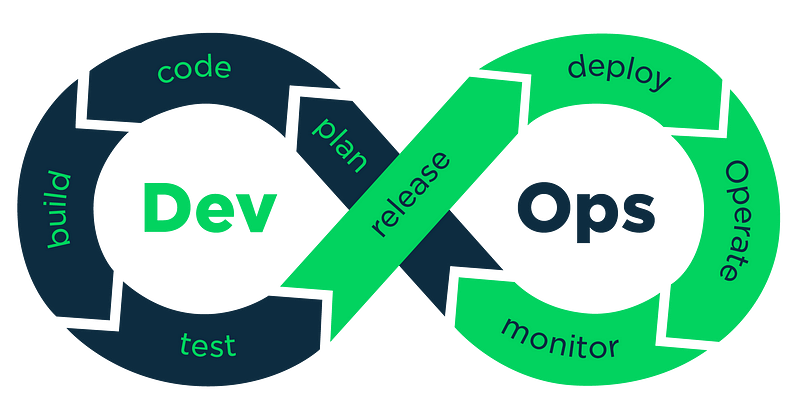
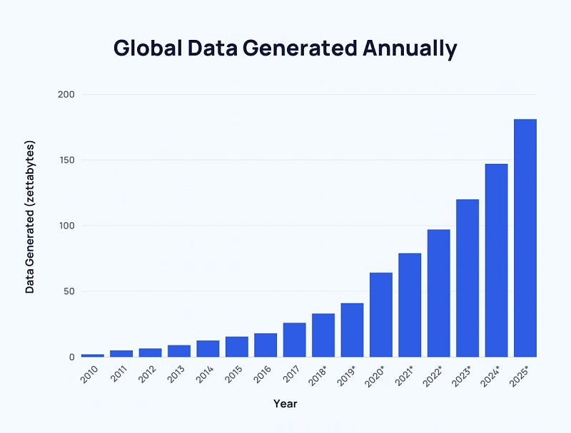
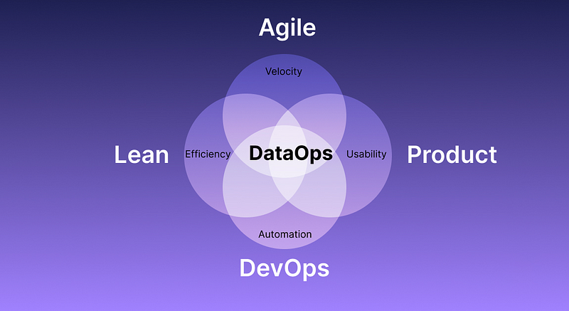

The big question is what exactly is DataSecOps and how did we get here? It wasn't born from nothing — it derives from years of shifts in technical development that brought about DevOps, SecOps, and now conjunctions of those within the data space. But first, let's start from the beginning to paint a better picture.

---

## The Dawn of DevOps

Years ago before agile methodologies took over, software products used waterfall methodology, a sequential and linear approach to development. Teams consisted of a development team that designs and builds the system from scratch, and an operations team for testing and implementing what was developed. The operations team would give the development team feedback on any bugs that needed fixing or any rework, while the development team would be idle, awaiting that feedback. This extended timelines and delayed the entire software development cycle. There would be instances where the development team moves on to the next project while the operations team continues to provide feedback for the previous code. This meant weeks or months for the project to be closed and the final code to be released.

From that realization, DevOps was born to break down those walls with a process to improve efficiency, deliver quickly, and achieve smoother and consistent deployments through several phases and tools. This, in combination with applications and development moving to the cloud in a more agile way brought with it added security risks. After a few years of data breaches, some really smart people got together and realized security needed to be woven into that process.

## The Need for DevSecOps

As development and operations were siloed prior, so was security. The DevOps cycle would run, and when it came time for deployment, it would be sent to the security team to run tests, analyze code changes, and look for security issues in the application. This could take days or weeks and was a major bottleneck in the software development life cycle (SDLC). Only this issue was compounded with the now very efficient and optimized DevOps cycle, pushing new versions out faster than the security vulnerabilities could be addressed.

How did this become such an issue? That is due to the market shift in microservices versus monolith applications. Microservices expose APIs to communicate which means a larger attack surface. Microservices also use services themselves such as databases, message brokers, applications, etc. — increasing the attack surface that much more. They typically run in containers such as Docker or Kubernetes clusters that usually run on a cloud platform like AWS or Azure, leading to additional attack surfaces. We now have many layers of infrastructure, applications, and components that need security which the security team needs to learn and understand all these platforms and technologies to be able to identify the issues.

From this, DevSecOps was born by shifting security to the left and weaving it into the SDLC from the very beginning and at every step along the way instead of right before release. This means security is a developer's responsibility and the security team is more of a facilitator and advisor to the developers and operations teams — helping them understand and manage security rather than blocking development. The security team creates security policies, builds or selects proper tools for detecting security issues and vulnerabilities, and then trains and teaches the developers and operations team how to interpret the output of those tools so they can identify and fix the issues themselves.

## Where Does Data Fit?

It took a while for data to follow suit of software and move to the cloud, but now that it's here, it's here to stay — as it needs to be agnostic to support all the applications that migrated to the cloud. In the past decade, the ability to store and process massive amounts of data without needing to invest in servers has fueled significant advancements in data-driven approaches. This shift has led organizations to adopt cloud-based solutions and use data warehouses and data lakes. For end-users accessing data through platforms like Snowflake, Redshift, or BigQuery, it often involves simple "select" queries, making large-scale data feel as accessible as smaller databases. This concept that puts more data into more hands — known as "Data Democratization" — means that even with basic skills and powerful BI tools, many people can effectively utilize organizational data.

Data isn't getting any smaller or easier to manage. Data creation has experienced exponential growth from 2 zettabytes globally in 2010 to 64.2 zettabytes in 2020. With more people and teams adding and consuming data, teams need to evolve and adopt a DataOps mindset. Just like software, data engineering and development have become more agile, leading to developers needing more skills in scripting, automation, testing, integration, and deployment.

## DataOps is Born

DataOps takes its lead from concepts like DevOps to help organizations deliver the right data to the business faster. Just like the issues before DevOps, data was traditionally utilizing waterfall methodology. The business would ask for specific transformed data, developers would go back and try to add the data to the warehouse and it was slow, messy, difficult to scale, and riddled with the same malignancies of linear sequential processes. Way before Richard Hendricks discovered the "middle-out" algorithm in *Silicon Valley*. Great show by the way.

DataOps is a new approach that focuses on the seamless and efficient management of data within your organization. It is inspired by DevOps, agile, and quality control approaches and it borrows many of their principles and practices but specializes in data. DataOps aims to bridge the gap between data engineering, data science, and operations teams by promoting continuous integration and delivery, collaboration, and automation of all data-related processes. It emphasizes the need for optimization and development of data pipelines with a high level of data quality and data governance. It's composed mainly of these five points.

### Automation

A vital role in DataOps is the automation of repetitive tasks such as data ingestion, transformation, and validation as well as deployment of infrastructure, applications, and pipelines. This aims to minimize manual errors, improve data quality, and accelerate the data life cycle.

### CI/CD

As DataOps borrows from Agile and DevOps methodologies, it brings with it Continuous Integration and Continuous Delivery (CI/CD). CI/CD focuses on delivering data quickly and predictably while also ensuring a high level of quality, reliability, and security. This enables organizations to respond quickly to rapidly changing business needs and get their insights out much faster.

### Monitoring

DataOps borrows quality control approaches like statistical process control and total quality management and emphasizes the importance of monitoring data pipelines and processes to identify key issues and bottlenecks. Monitoring tools and techniques help track data quality, performance, and availability — enabling proactive troubleshooting and a timely response to potential problems.

### Version Control

DataOps promotes the use of version control systems like Git to manage changes to data infrastructure, application configuration, code, and sometimes data itself. This ensures you can go back and audit everything or roll back to previous versions if you need to. We've just recently seen Snowflake adopt Git to its integration as well as Matillion with DPC and their BYOG (Bring Your Own Git). Shameless plug to [my other post on that](/blog/snowflake-git-kestra).

### Data Governance

DataOps emphasizes the need for proper data governance practices and includes establishing data quality standards, data cataloging, and data lineage to improve the usability and value of your data. It also ensures compliance with regulations, access control, and maintaining the integrity of your data. This enhances the trust that your organization has with its data when making important decisions.

## The Importance of DataSecOps

Just as the SDLC grew and changed in regards to security having to be implemented earlier, so too must DataOps. As more consumers of data are being brought in to develop, maintain, and analyze data through its life cycle, the need for better security practices is compounded. No longer can it be an afterthought — it needs to be involved from the beginning and a continuous part of the data operations process. Data itself and access to it change rapidly, and as more people can access more data, security needs to be a constant part of the operation.

DataSecOps brings with it the understanding that more organizations are dealing with increased sensitive data that can cause a lot of harm in the wrong hands. Data security is both a major asset and a liability to companies because of privacy and protection regulations and the risk of exposure. At the same time, understanding the importance of time-to-value and that security can't be a bottleneck in the data lifecycle. While it's also important everybody gets more data to finish projects faster, it shouldn't come with careless compromises to security.

Cloud data warehouses like Snowflake have responded to this need for added security by recently implementing data access and data masking policies into public preview. Admins can create and apply masking policies for PII and other sensitive information that are attached to roles certain users are privy to. This makes sure those accessing the data are only able to see what's necessary to complete their task and minimize exposure.

As DataSecOps and the security around handling data becomes more crucial, software companies are making impressive strides in ways to alleviate the complexity and stress of having to manage this alone across your data platforms and pipelines. An up-and-coming star to watch in this space is Satori — a dedicated DataSecOps solution that streamlines access with role-based access control (RBAC), dynamic masking policies to change as fast as your data does, and built-in audits for compliance and data governance across your entire stack.
