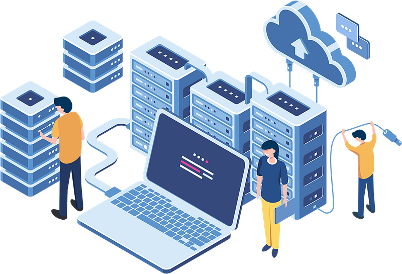

When people hear **"IT Operations"**, they often think of servers, networks, SaaS solutions and other tools. The definition of it is often referred to as the management and maintenance of IT infrastructure, ensuring IT systems run efficiently and cost-effectively. While that is true and infrastructure does matter, it misses the whole point.

> **IT Operations isn't about systems. It's about enabling people.**

---

## The Business Doesn't Run on Technology, it Runs on People

Every department in an organization has a mission:

- **Finance** needs accurate systems and secure access
- **Sales** needs tools that support speed and communication
- **Operations** needs reliability and consistency
- **HR** needs platforms that support employees
- **Leadership** needs trust in the organization's ability to execute

**Technology** is the environment all those teams work inside and **IT Operations** is responsible for that environment. The best IT organizations don't just "support the business" — they remove friction so the business can move faster. When IT Ops is working well:

- Employees aren't fighting their tools
- Teams aren't blocked by access or downtime
- Security doesn't feel like a barrier
- Onboarding and offboarding is smooth
- Collaboration is natural

In many ways, success is measured by what people **don't** notice. The absence of disruption is a form of excellence here. This is often why IT Ops is overlooked, understaffed, and underinvested. There isn't always a direct and clear return on investment — instead that is measured by the success and efficiency of what it aides and enables. This requires deeper understanding as well as listening and looking closely at all aspects and operations of the business.

## Tools Are Only Valuable When They Equip Teams

IT Leaders often get caught up in platforms, architectures, and vendor decisions — but the real question is **Does this help our people do their jobs better?** Technology isn't the outcome. Productivity, effectiveness, and execution are.

## The Shift Into Operational Leadership

Earlier in my career as an engineer I wasn't solely focused on the deliverable, but how it was delivered. I was fascinated by the multitude of approaches to solve the same problem through various technology, people, and process. I was lucky enough to work, learn, and observe engineering in Fortune 500s, mid-market businesses, startups, and as a consultant across many industries. It took many years to iterate and make sense of those observations and the knowledge gained, but the wisdom and insight accumulated was worth far more than any paycheck.

As I shifted from engineering to leadership and strategy roles, my responsibilities naturally expanded to:

- Ensuring reliability at scale
- Creating repeatable operational processes
- Equipping teams with the right tools
- Aligning IT execution with business priorities

The job became less about managing infrastructure, and more about enabling performance.

## IT Operations as a Strategic Advantage

Organizations that treat IT Ops as purely reactive support will always struggle — because they lock IT into firefighting, which makes it almost impossible for technology to support growth or strategy. Reactive IT looks cheaper up front but is more expensive overall: when security wasn't invested in and you have a breach or compromise; when process doesn't scale when you take on new lines of business at a critical investment window; or when the organization needs something that's not deliverable on time because the underlying foundations weren't considered a value-add.

Organizations that treat IT Ops as a strategic enabler gain:

- Faster execution
- Higher employee effectiveness
- Stronger security posture
- Better business continuity
- Greater trust across departments and clients

> **IT Operations is not overhead.
> It's leverage.**

## What to Do Next?

If you're responsible for IT in your organization, don't let this stay as theory. Pick one or two of these prompts and act on them.

- Ask your teams: **Which tools are slowing you down or getting in your way?** Listen for patterns and friction, not just bug reports.
- List the top 3 processes that would break or bottleneck if your company doubled in size or added a new product line tomorrow. Use that list to prioritize IT Ops work.
- Take one current IT project and rewrite its goal in terms of the people outcome, not the system outcome. For example, **"new laptop rollout"** becomes **"reduce time-to-productive for new hires by 50%"**.

> **The best IT Operations teams aren't noticed because systems work.
> They're remembered because people thrive.**
