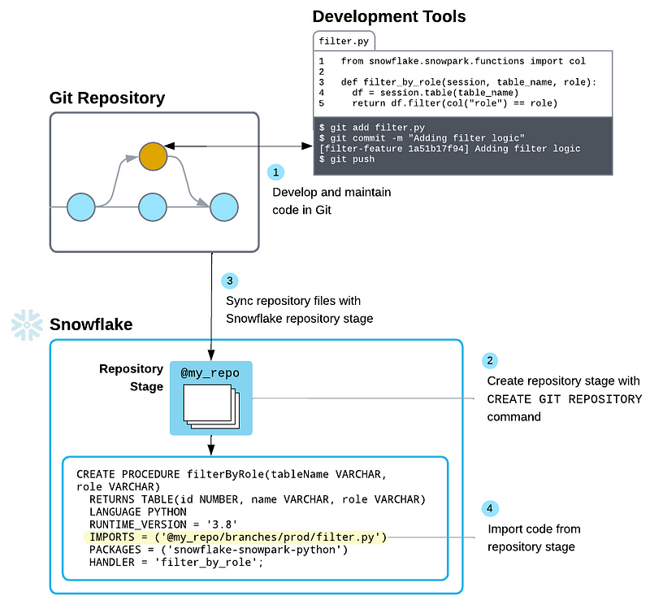
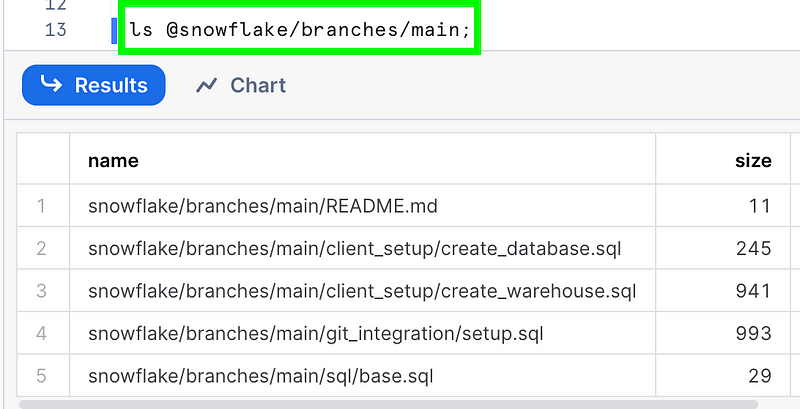
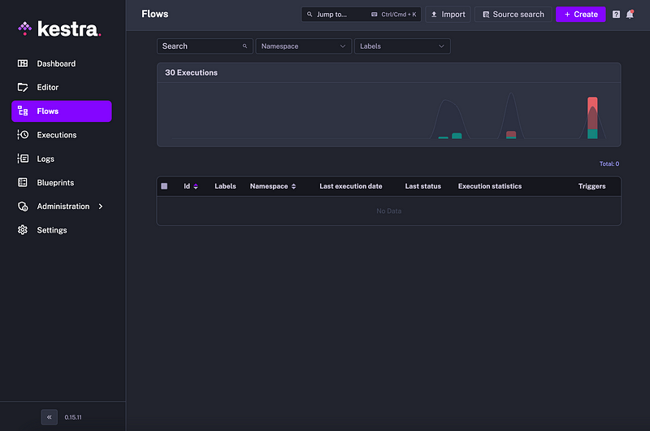
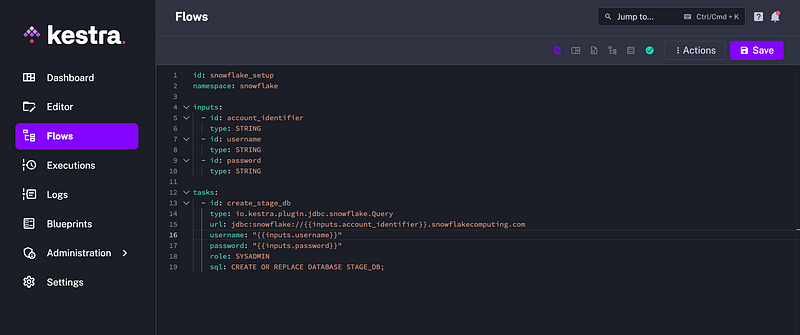
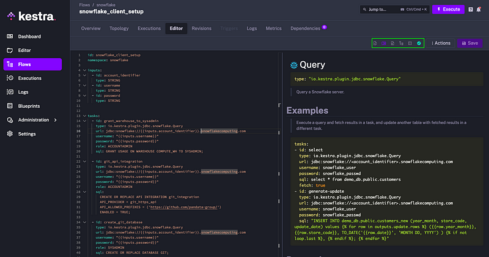
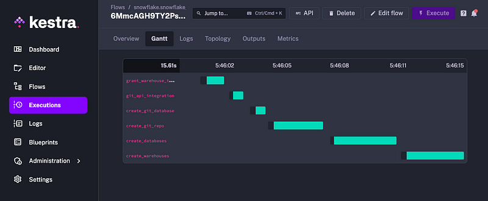
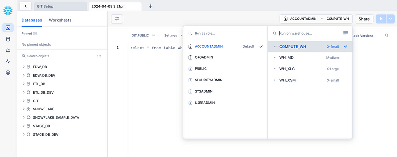

Snowflake has just released its Git integration to public preview across all clouds, giving you a "source of truth" for your SQL scripts, Snowpark functions, procedures, and apps. This opens many doors for automation, particularly when integrated with [Kestra](https://kestra.io/), an open-source declarative data orchestration tool.



---

## Setting up Snowflake Git

First, we need to connect our git repository to our Snowflake account. If you are integrating a private repo, you need to create a secret to contain the credentials for authenticating. If using a public repo, skip this.

```sql
USE ROLE ACCOUNTADMIN;
CREATE OR REPLACE SECRET git_secret
  TYPE = password
  USERNAME = 'gh_username'
  PASSWORD = 'ghp_token';
```

Note: You will need to generate a personal access token scoped to the appropriate repo(s).

Next, we will create an **API Integration (using ACCOUNTADMIN)** that allows the git traffic between our Snowflake instance and the repository.

```sql
CREATE OR REPLACE API INTEGRATION git_integration
  API_PROVIDER = git_https_api
  API_ALLOWED_PREFIXES = ('https://github.com/<my-account>/')
  -- ALLOWED_AUTHENTICATION_SECRETS = (git_secret)
  ENABLED = TRUE;
```

To verify this has been created we can use `SHOW API INTEGRATIONS;`

Lastly, we need to create the **Git Repository** in Snowflake, which represents the external Git repo and includes a cache of all files from its branches, tags, and commits.

```sql
CREATE OR REPLACE GIT REPOSITORY snowflake
  API_INTEGRATION = git_integration
  -- GIT_CREDENTIALS = my_secret if needed
  ORIGIN = 'https://github.com/<my-account>/snowflake.git';
```

You can test this by trying to list the contents of your repo from within Snowflake. It has a special logical naming structure so you can navigate across files in different branches (`@repo_name/branches/branch_name`), tags (`@repo_name/tags/tag_name`), or commits (`@repo_name/commits/commit_hash`).



To refresh the repository in Snowflake after making changes, you can run the fetch command:

```sql
ALTER GIT REPOSITORY snowflake FETCH;
```

---

## Integrating with Kestra

Kestra is a new data orchestration tool similar to Airflow but simpler and addresses Airflow's shortcomings with scalability and a challenging Python environment to manage. Flows are YAML-based, making it easy to read and understand, allowing non-developers the ability to design orchestrations.

Kestra has cloud and enterprise editions available, as well as the option to self-host and deploy in Docker, Kubernetes, or a public cloud.

In this example, we will be using Kestra to set up a new Snowflake instance to our "standards", similar to how we would set up a new client account. If you wish to follow along, simply sign up for a [Snowflake Trial Account](https://signup.snowflake.com/) with just a few short clicks.

### Create a Flow

In Kestra, go to **Flows** and click **Create**.



You will then be presented with a YAML editor. Copy the following code and we will break down the various parts:

```yaml
id: snowflake_setup
namespace: snowflake

inputs:
  - id: account_identifier
    type: STRING
  - id: username
    type: STRING
  - id: password
    type: STRING

tasks:
  - id: create_stage_db
    type: io.kestra.plugin.jdbc.snowflake.Query
    url: jdbc:snowflake://{{inputs.account_identifier}}.snowflakecomputing.com
    username: "{{inputs.username}}"
    password: "{{inputs.password}}"
    role: SYSADMIN
    sql: CREATE OR REPLACE DATABASE STAGE_DB;
```

Your screen should look like this:



Let's dig into the code line by line:

- `id` — The id on top is the name for your flow and needs to be unique in the given namespace.
- `namespace` — These group the flows and cannot be changed once saved.
- `inputs` — Parameters used for making flows dynamic and reusable, these are determined at runtime.
- `tasks` — Discrete actions capable of taking inputs and variables from the flow, performing computations, and producing outputs for downstream consumption.

Kestra makes writing flows easy by adding a live documentation window to aid you as you type. If you select the **Source and Documentation** view in the top right, the part your cursor is on will display its documentation on the right with examples, properties, outputs, and definitions to help you.



The task we've created will prompt the user to enter the `account identifier`, `username`, and `password` for Snowflake and then pass those credentials to Snowflake to execute the SQL statement to create the STAGE_DB database. Save the flow, hit **Execute** on top, enter your credentials and run the flow.

### Automate Snowflake Git with Kestra

Now that we've successfully run and understand our first Kestra flow, we can add to it. Let's automate the Snowflake Git integration setup. We will remove the task ID and replace it with SQL to set up our public repo.

```yaml
id: snowflake_setup
namespace: snowflake

inputs:
  - id: account_identifier
    type: STRING
  - id: username
    type: STRING
  - id: password
    type: STRING

tasks:
  - id: grant_warehouse_to_sysadmin
    type: io.kestra.plugin.jdbc.snowflake.Query
    url: jdbc:snowflake://{{inputs.account_identifier}}.snowflakecomputing.com
    username: "{{inputs.username}}"
    password: "{{inputs.password}}"
    role: ACCOUNTADMIN
    sql: GRANT USAGE ON WAREHOUSE COMPUTE_WH TO SYSADMIN;

  - id: git_api_integration
    type: io.kestra.plugin.jdbc.snowflake.Query
    url: jdbc:snowflake://{{inputs.account_identifier}}.snowflakecomputing.com
    username: "{{inputs.username}}"
    password: "{{inputs.password}}"
    role: ACCOUNTADMIN
    sql: >
      CREATE OR REPLACE API INTEGRATION git_integration
      API_PROVIDER = git_https_api
      API_ALLOWED_PREFIXES = ('https://github.com/<my-account>/')
      ENABLED = TRUE;

  - id: create_git_database
    type: io.kestra.plugin.jdbc.snowflake.Query
    url: jdbc:snowflake://{{inputs.account_identifier}}.snowflakecomputing.com
    username: "{{inputs.username}}"
    password: "{{inputs.password}}"
    role: SYSADMIN
    sql: CREATE OR REPLACE DATABASE GIT;

  - id: create_git_repo
    type: io.kestra.plugin.jdbc.snowflake.Query
    url: jdbc:snowflake://{{inputs.account_identifier}}.snowflakecomputing.com
    username: "{{inputs.username}}"
    password: "{{inputs.password}}"
    role: SYSADMIN
    database: GIT
    schema: PUBLIC
    sql: >
      CREATE OR REPLACE GIT REPOSITORY snowflake
      API_INTEGRATION = git_integration
      ORIGIN = 'https://github.com/<my-account>/snowflake.git';
```

Make sure to replace `my-account` with your GitHub organization. We had to add a few more properties to declare `role`, `database`, and `schema` depending on the SQL statement. We've also created a new database named **GIT** to house the repository metadata.

Now that we have the Git integration automated, we can build out batch SQL scripts to call and run. Create a `create_database.sql` file with the following statements:

```sql
CREATE OR REPLACE DATABASE STAGE_DB;
CREATE OR REPLACE DATABASE STAGE_DB_DEV;
CREATE OR REPLACE DATABASE ETL_DB;
CREATE OR REPLACE DATABASE ETL_DB_DEV;
CREATE OR REPLACE DATABASE EDW_DB;
CREATE OR REPLACE DATABASE EDW_DB_DEV;
```

Let's also create a `create_warehouse.sql` file with the following:

```sql
-- Creates x-small warehouse
CREATE OR REPLACE WAREHOUSE WH_XSM
  WAREHOUSE_SIZE = 'XSMALL'
  WAREHOUSE_TYPE = 'STANDARD'
  AUTO_SUSPEND = 300
  AUTO_RESUME = TRUE
  SCALING_POLICY = 'STANDARD'
  MIN_CLUSTER_COUNT = 1
  MAX_CLUSTER_COUNT = 3
  INITIALLY_SUSPENDED = TRUE;

-- Creates medium warehouse
CREATE OR REPLACE WAREHOUSE WH_MD
  WAREHOUSE_SIZE = 'MEDIUM'
  WAREHOUSE_TYPE = 'STANDARD'
  AUTO_SUSPEND = 300
  AUTO_RESUME = TRUE
  SCALING_POLICY = 'STANDARD'
  MIN_CLUSTER_COUNT = 1
  MAX_CLUSTER_COUNT = 5
  INITIALLY_SUSPENDED = TRUE;

-- Creates x-large warehouse
CREATE OR REPLACE WAREHOUSE WH_XLG
  WAREHOUSE_SIZE = 'XLARGE'
  WAREHOUSE_TYPE = 'STANDARD'
  AUTO_SUSPEND = 300
  AUTO_RESUME = TRUE
  SCALING_POLICY = 'STANDARD'
  MIN_CLUSTER_COUNT = 1
  MAX_CLUSTER_COUNT = 8
  INITIALLY_SUSPENDED = TRUE;
```

Commit the changes and sync to your repository so it's visible on GitHub. With that in our GitHub repo, we can go back to Kestra to add the calls for those two batch scripts. Add the following new tasks to the end of your `snowflake_setup` flow:

```yaml
  - id: create_databases
    type: io.kestra.plugin.jdbc.snowflake.Query
    url: jdbc:snowflake://{{inputs.account_identifier}}.snowflakecomputing.com
    username: "{{inputs.username}}"
    password: "{{inputs.password}}"
    role: SYSADMIN
    database: GIT
    schema: PUBLIC
    sql: EXECUTE IMMEDIATE FROM @snowflake/branches/main/client_setup/create_database.sql;

  - id: create_warehouses
    type: io.kestra.plugin.jdbc.snowflake.Query
    url: jdbc:snowflake://{{inputs.account_identifier}}.snowflakecomputing.com
    username: "{{inputs.username}}"
    password: "{{inputs.password}}"
    role: SYSADMIN
    database: GIT
    schema: PUBLIC
    sql: EXECUTE IMMEDIATE FROM @snowflake/branches/main/client_setup/create_warehouse.sql;
```

We can call and run scripts stored in Git with the `EXECUTE IMMEDIATE` call:

```sql
EXECUTE IMMEDIATE FROM @<repo_name>/branches/main/<name>.sql
```

And that's all there is to it. We can save the flow, hit execute, populate our inputs for `account identifier`, `username`, and `password` and let it run. Kestra will show you in real time as it executes each task, logs responses/metrics, and shows any errors that occurred.



We can check our Snowflake instance to confirm all the databases and warehouses were created:



This example is just the beginning of what can be accomplished between Snowflake Git and Kestra, for both automating repetitive tasks and having a "source of truth" repository to house all your important code and standards. Hopefully, this brings enough familiarity and understanding to get those gears turning around the endless possibilities with these two tools.

---

**References:**
- [Snowflake Git Documentation](https://docs.snowflake.com/en/developer-guide/git/git-overview)
- [Kestra Documentation](https://kestra.io/docs)
